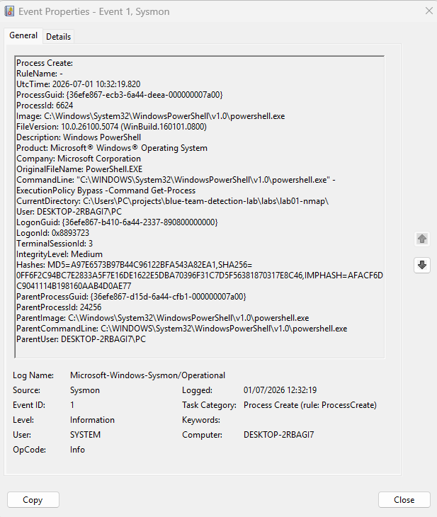
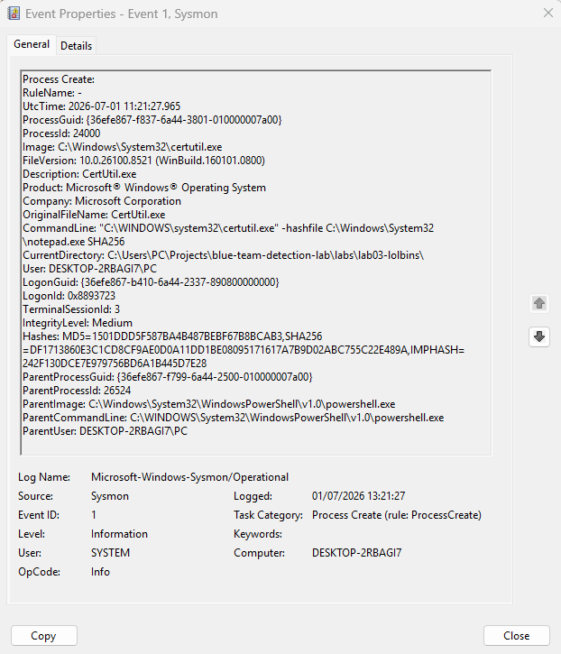
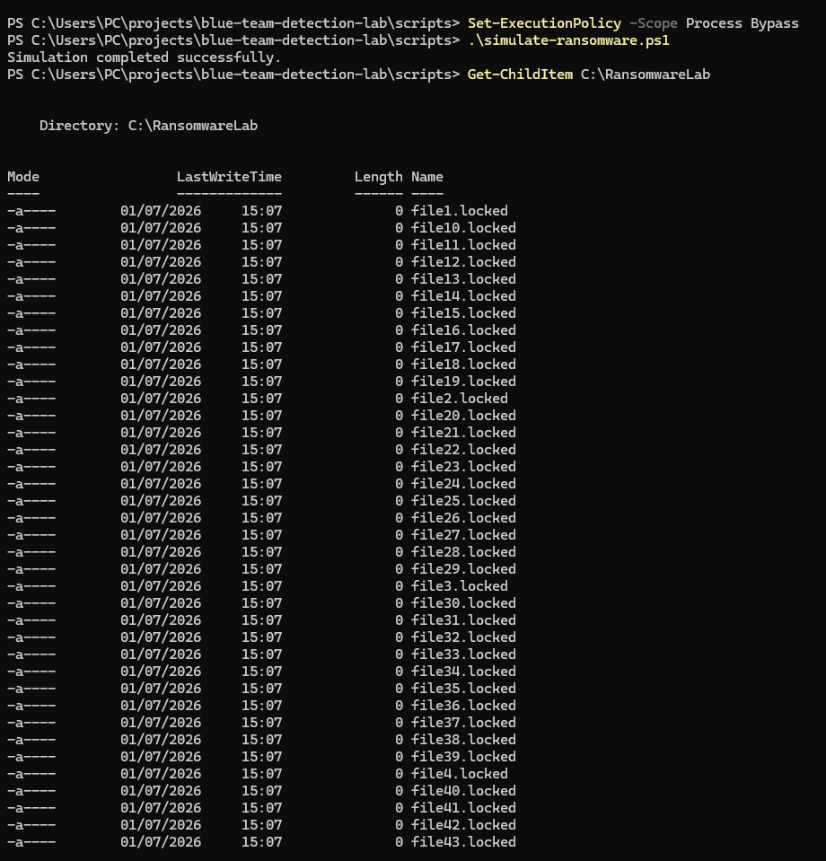

# 🛡️ Blue Team Detection Lab


---

## 📖 About

This repository contains practical Blue Team and Detection Engineering labs built on real Windows telemetry.

The goal is to demonstrate hands-on experience in:

- Security Operations Center (SOC)
- Detection Engineering
- Threat Hunting
- Incident Response
- Windows Event Log Analysis
- Sysmon Analysis
- MITRE ATT&CK Mapping
- Sigma Rule Development
- Microsoft Sentinel (KQL)
- Splunk SPL
- IOC Analysis

---

## 🛠️ Technologies

- Windows 11
- Sysmon
- Event Viewer
- PowerShell
- Nmap
- Sigma
- KQL
- Splunk SPL
- MITRE ATT&CK

---

# 📂 Repository Structure

```text
blue-team-detection-lab
│
├── detections
│   ├── sigma
│   ├── kql
│   ├── splunk
│   └── yara
│
├── labs
├── reports
├── screenshots
├── scripts
└── docs
```

---

# 🧪 Labs

| Lab | Topic | Status |
|------|-------|:------:|
| Lab01 | Nmap Reconnaissance | ✅ |
| Lab02 | Suspicious PowerShell Detection | ✅ |
| Lab03 | LOLBins Detection | ✅ |
| Lab04 | Phishing Investigation | ✅ |
| Lab05 | Ransomware Simulation | ✅ |
| Lab06 | Windows Persistence Detection | ✅ |
| Lab07 | Threat Hunting | ⏳ |


---

# 📸 Lab Highlights

## Lab02 – PowerShell Detection



## Lab03 – LOLBins Detection



## Lab05 – Ransomware Simulation



## Lab06 – Windows Persistence Detection


---

# 🧠 Detection Content

## Sigma Rules

- Suspicious PowerShell Execution
- Suspicious Certutil Usage
- Suspicious BITSAdmin Usage
- Suspicious Rundll32 Execution
- Suspicious Regsvr32 Execution
- Ransomware Related Process Execution
- Registry Run Key Persistence

## KQL Queries

- PowerShell Detection
- Certutil Detection
- BITSAdmin Detection
- Rundll32 Detection
- Ransomware Process Detection
- Registry Run Key Detection

## Splunk Searches

- Suspicious PowerShell
- Ransomware Process Activity
- Registry Run Key Persistence

---

# 🎯 Skills Demonstrated

- Windows Event Log Analysis
- Sysmon Investigation
- Detection Engineering
- Sigma Rule Development
- KQL Queries
- Splunk Searches
- IOC Analysis
- MITRE ATT&CK Mapping
- Email Header Analysis
- Threat Hunting

---

# 📜 Detection Content

Current repository includes:

- Sigma Rules
- KQL Queries
- Investigation Reports
- IOC Documentation
- MITRE ATT&CK Mapping
- Detection Recommendations

---

# 🚀 Roadmap

- [x] Lab01 – Network Reconnaissance
- [x] Lab02 – PowerShell Detection
- [x] Lab03 – LOLBins Detection
- [x] Lab04 – Phishing Investigation
- [ ] Lab05 – Ransomware Investigation
- [ ] Lab06 – Windows Persistence
- [ ] Lab07 – Credential Access Detection
- [ ] Lab08 – Threat Hunting
- [ ] Lab09 – Lateral Movement Detection
- [ ] Lab10 – Incident Response Case Study

---

# 🎯 Goal

Build a professional Blue Team portfolio demonstrating practical Detection Engineering and SOC investigation skills using real Windows logs, Sysmon telemetry, Sigma rules, and MITRE ATT&CK.
