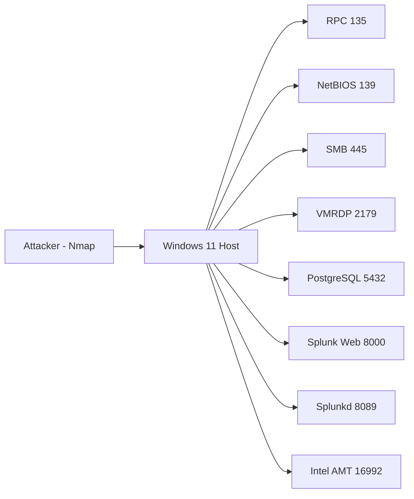

# Lab 01 - Network Reconnaissance using Nmap

## Scenario

A Security Operations Center (SOC) detects suspicious reconnaissance activity originating from an internal workstation.

The objective of this investigation is to identify the attacker activity, determine the MITRE ATT&CK technique, collect Indicators of Compromise (IOCs), and recommend defensive measures.

---

## Objectives

- Perform network reconnaissance using Nmap
- Observe generated network traffic
- Identify attacker behavior
- Detect reconnaissance activity
- Map activity to MITRE ATT&CK
- Create detection opportunities

---
## Lab Topology

---

## Environment

| Component | Version |
|------------|----------|
| Attacker | Kali Linux |
| Target | Windows 11 |
| Tools | Nmap, Wireshark, Sysmon |
| Network | VirtualBox Internal Network |

---

## Skills Demonstrated

- Network Reconnaissance
- Threat Hunting
- SOC Investigation
- MITRE ATT&CK Mapping
- IOC Collection
- Detection Engineering

## Evidence

### Screenshots

- ✔ Nmap Output
- ✔ Open Ports
- ✔ Host Details
- ✔ Network Topology
- ✔ Scan Summary

See the `screenshots/` directory.

---

### Logs

Raw scan results are available inside the `logs/` directory.

---

## Lessons Learned

- Reconnaissance is the first phase of many attacks.
- Open ports expose potential attack surface.
- SMB remains a high-value target.
- Management interfaces should never be publicly exposed.
- Continuous monitoring helps detect reconnaissance early.